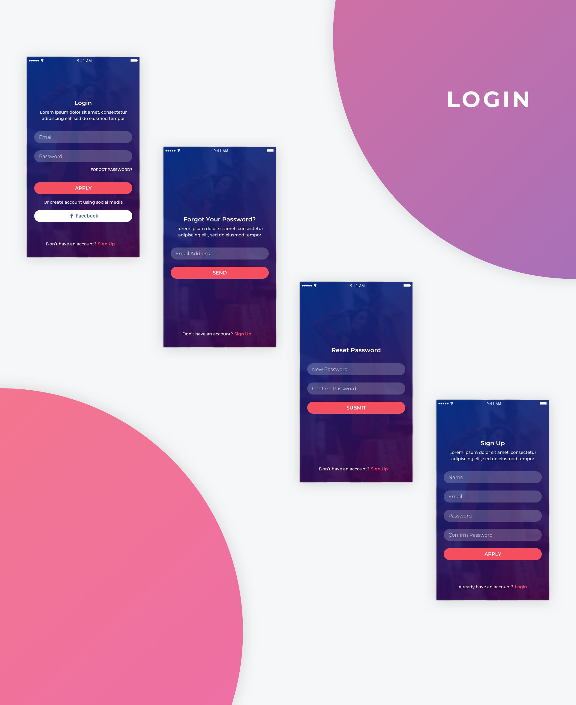
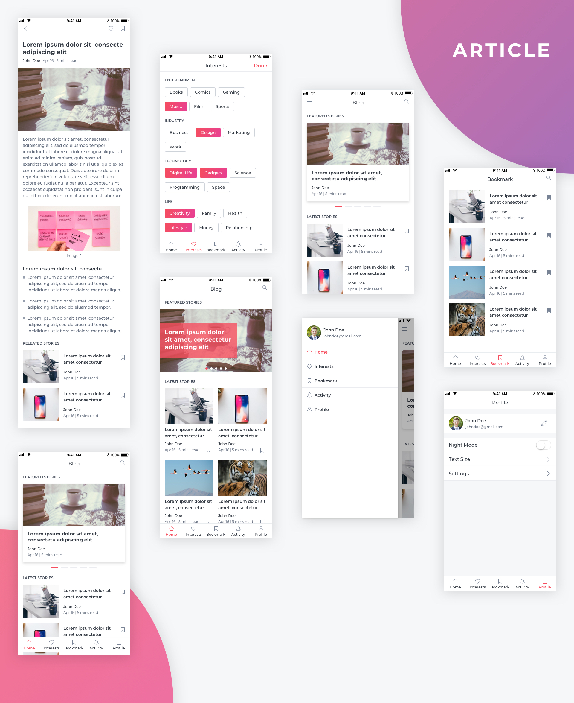
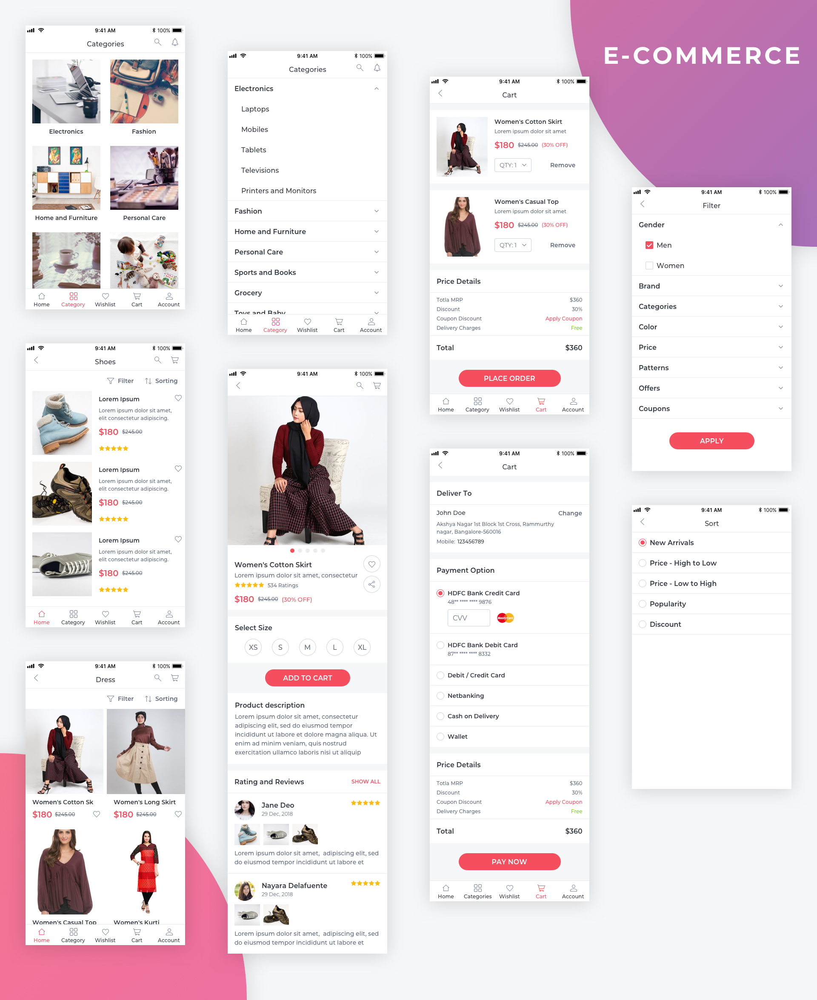
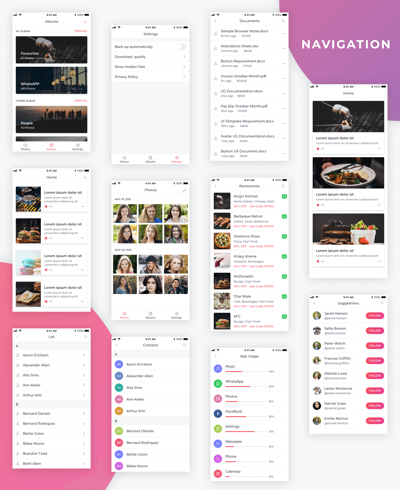
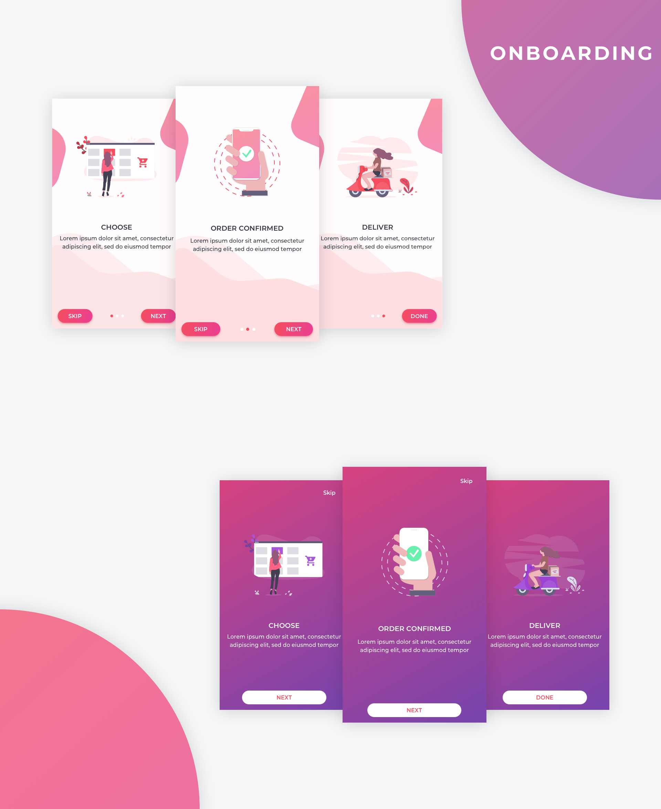
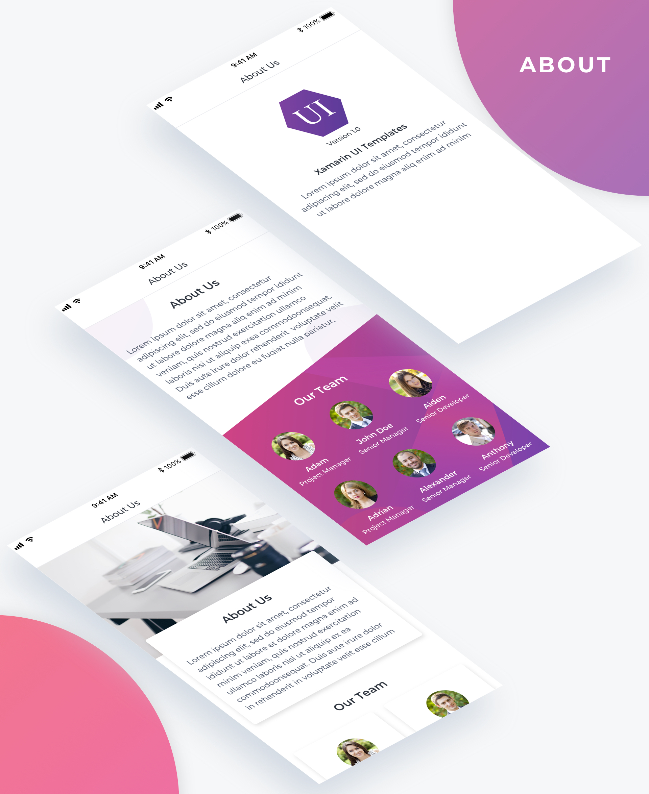
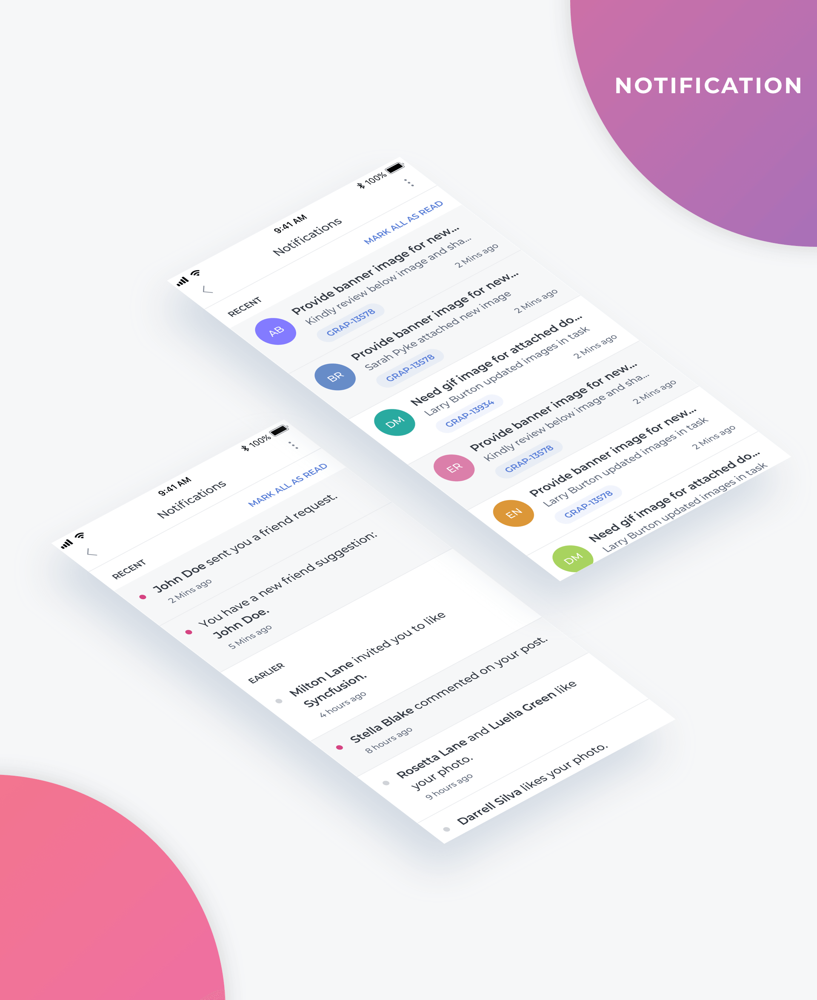

# Essential UI Kit for Xamarin.Forms
This [Essential UI Kit](https://www.syncfusion.com/essential-xamarin-ui-kit) repository contains elegantly designed XAML templates for Xamarin.Forms apps. These templates are compatible with Android, iOS, and UWP platforms, and use the MVVM design pattern to provide trouble-free integration.

 <b> Install the app to preview the templates instantly </b> 

  

    

## Table of Contents

* [Build Status](#build-status)
* [Key Features](#key-features)
* [Supported Platforms](#supported-platforms)
* [System Requirements](#system-requirements)
* [The Visual Studio Extension](#the-visual-studio-extension)
* [Coding Style](#coding-style)
* [Recent Blogs](#recent-blogs--news)
* [Screenshots](#screenshots)
* [Requesting Screens & Reporting Bugs](#requesting-screens--reporting-bugs)
* [License](#license)
* [About Syncfusion](#about-syncfusion)

## Build Status
|CI Tool                    |Build Status|
|---------------------------|---|
| App Center, iOS | | 
| App Center, Android |  |

## Key Features
* Rich, elegant XAML layouts for most common scenarios.
* Layouts optimized for phones, tablets, and desktop.
* Based on the MVVM design pattern to work with any MVVM framework.
* Easy integration.
* Developer-friendly APIs.
* Appearance customization using styles.
* Optimized layouts to get the best possible performance.
* Right-to-left rendering support.

## Supported Platforms
* Android 5.0 (or API level 21) and later versions.
* iOS 9.0 and later versions.
* UWP Build 17763 and later versions

The required minimum version of Xamarin.Forms is 4.0.0.425677.

## System Requirements
Refer to the [Xamarin system requirements](https://docs.microsoft.com/en-us/xamarin/cross-platform/get-started/requirements) documentation to learn more about the development environments.

## The Visual Studio Extension
The Visual Studio extension allows you to add the required templates quickly through a few clicks. The extension setup is available in the Visual Studio Marketplace with detailed information on how to add the templates.

https://marketplace.visualstudio.com/items?itemName=SyncfusionInc.Essential-UI-Kit-Xamarin-Forms

## Coding Style
We follow the style used by the .NET Foundation, with a few exceptions:
* We use tabs instead of spaces.
* We do not prefix internal and private instance fields with `_`, static fields with `s_` and thread static fields with `t_`.

## Recent Blogs / News
* https://www.syncfusion.com/blogs/post/create-beautiful-mobile-apps-in-20-minutes-with-the-new-xamarin-ui-kit-webinar-qa.aspx
* https://www.syncfusion.com/blogs/post/the-essential-ui-kit-for-xamarin-forms-is-ready-to-use.aspx
* https://www.syncfusion.com/blogs/post/sneak-peek-new-essential-ui-kit-for-xamarin-forms.aspx
* https://www.syncfusion.com/blogs/post/introducing-ui-templates-for-xamarin-forms.aspx

## Screenshots

    

  

    

  

    

  

    

  

    

  

    

  

    

  

    

  

    

 <b> Install the app to preview the templates instantly </b> 

  

## Requesting Screens & Reporting Bugs
If you would like to request a new screen or report a bug in existing screens, create a feature request or submit a bug through our [feedback portal](https://www.syncfusion.com/feedback/xamarin-forms).

## License
These are samples/templates. The samples/templates may have various licenses but Syncfusion licenses this as [MIT](LICENSE). You may need to obtain additional licenses to use the samples/templates from third parties.

This project uses [Syncfusion controls](https://www.syncfusion.com/xamarin-ui-controls) and [FFImageLoading](https://github.com/daniel-luberda/FFImageLoading) (by Daniel Luberda) libraries.

The demo images and illustrations exhibited in this app are obtained from the following website.

* https://www.pexels.com/
* https://unsplash.com/
* https://undraw.co/illustrations

**Note:**  This license by no means modifies the license under which 3rd party intellectual property is provided and that such intellectual property is deemed directly licensed from the 3rd party by the user. You are solely responsible for obtaining all 3rd party licenses directly from the provider. These licenses to any third party intellectual property must be independently obtained by Customer from the provider.

## About Syncfusion
Founded in 2001 and headquartered in Research Triangle Park, N.C., Syncfusion has more than 20,000 customers and more than 1 million users, including large financial institutions, Fortune 500 companies, and global IT consultancies.

Today we provide 1,000+ controls and frameworks for web ([ASP.NET Core](https://www.syncfusion.com/aspnet-core-ui-controls), [ASP.NET MVC](https://www.syncfusion.com/aspnet-mvc-ui-controls), [ASP.NET WebForms](https://www.syncfusion.com/jquery/aspnet-web-forms-ui-controls), [JavaScript](https://www.syncfusion.com/javascript-ui-controls), [Angular](https://www.syncfusion.com/angular-ui-components), [React](https://www.syncfusion.com/react-ui-components), [Vue](https://www.syncfusion.com/vue-ui-components), and [Blazor](https://www.syncfusion.com/blazor-components), mobile ([Xamarin](https://www.syncfusion.com/xamarin-ui-controls),[Flutter](https://www.syncfusion.com/flutter-widgets), [UWP](https://www.syncfusion.com/uwp-ui-controls), and [JavaScript](https://www.syncfusion.com/javascript-ui-controls)), and desktop development ([WinForms](https://www.syncfusion.com/winforms-ui-controls), [WPF](https://www.syncfusion.com/products/wpf-ui-controls), and [UWP](https://www.syncfusion.com/uwp-ui-controls)). We provide ready-to deploy enterprise software for dashboards, reports, data integration, and big data processing. Many customers have saved millions in licensing fees by deploying our software.
